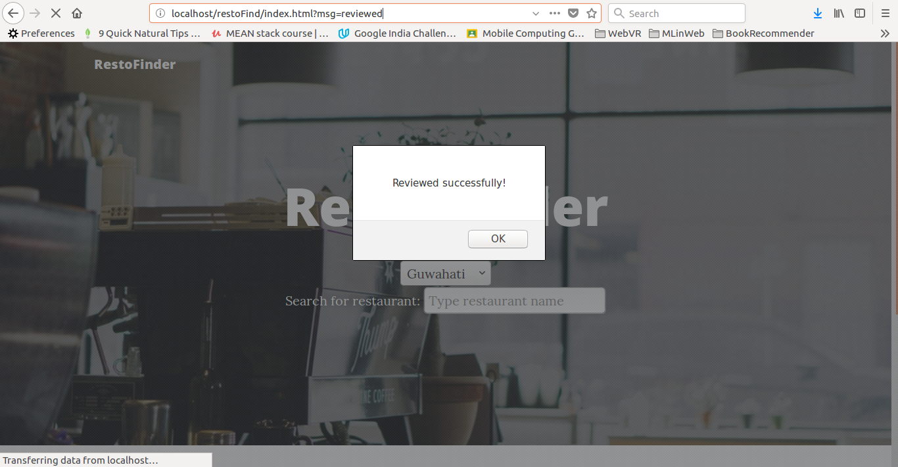

<h1>RestoFinder - A restaurant finder website using Zomato API</h1>

I developed this website as a task assigned to me.

I have used JQuery, AJAX, Bootstrap 4, PHP, Javascript, CSS & HTML for developing this website.

<h2>Screenshots of Application:<h2>
<h3>Home Page of application</h3>

<h3>Restaurants by city</h3>

<h3>Restaurant search in a city</h3>

<h3>Restaurant page, add reviews and ratings</h3>

<h3>Review successful!</h3>

